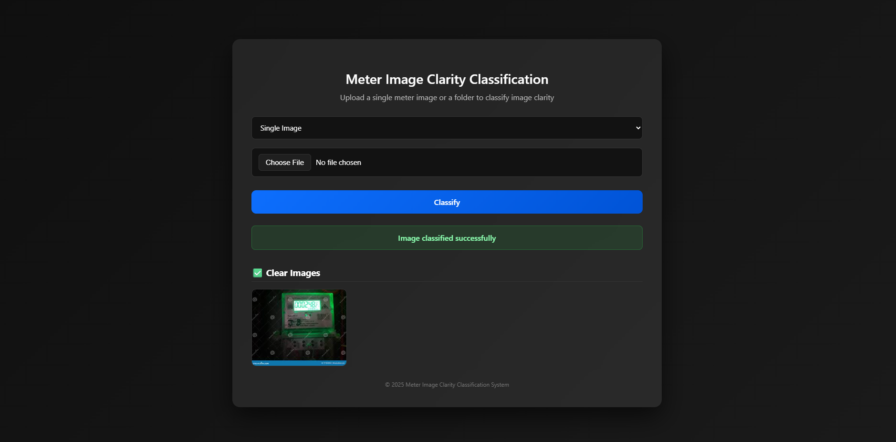
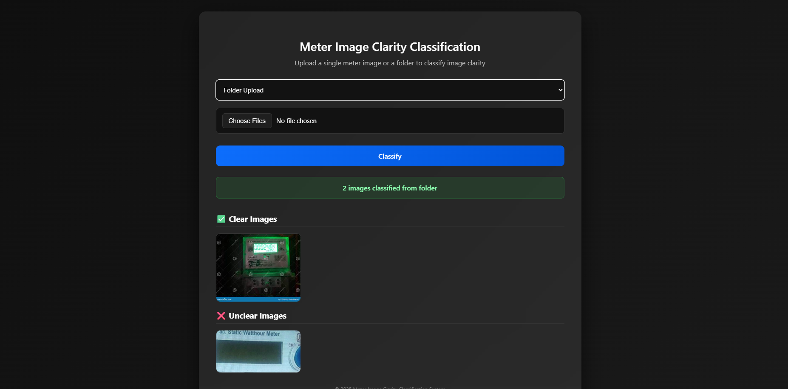

# Meter Image Clarity Classifier

🔗 **Live Demo:** https://meter-image-classification-3.onrender.com

The system classifies utility meter images as **Clear** or **Unclear** using a lightweight Convolutional Neural Network (MobileNetV2).  
The project includes a Flask-based web application for real-time inference, supporting both **single-image** and **batch (folder)** uploads with automatic result organization.

---

## Overview

This project leverages **transfer learning** with MobileNetV2 to determine whether a meter display image is readable.  
It filters out low-quality images affected by blur, glare, poor lighting, or focus issues before downstream processing.

### Key Highlights
- CNN-based image clarity classification  
- MobileNetV2 for efficient and accurate inference  
- Flask web application with professional dark-themed UI  
- Supports single and batch image uploads  
- Automatic output folder organization  

---

## Problem Statement

In real-world applications such as **automatic meter reading**, captured images frequently suffer from:
- Motion blur  
- Glare and reflections  
- Low illumination  
- Poor focus or occlusion  

This system automatically identifies unreadable images so that only high-quality inputs proceed to the next stage of the pipeline.

---

## Methodology

### Model Architecture

- **Model Type:** Convolutional Neural Network (CNN)  
- **Base Model:** MobileNetV2 (ImageNet pre-trained)  
- **Approach:** Transfer Learning  

**Output Classes**
- `0` → Clear  
- `1` → Unclear  

The original classification head of MobileNetV2 is replaced with a **2-class fully connected layer**.

---

## Dataset Structure

The dataset follows the **ImageFolder** format:
<pre>
- sample_quality/
- clear/
- image1.jpg
│ ├── image2.jpg
│ └── ...
└── unclear/
├── image1.jpg
├── image2.jpg
└── ...
  </pre>
- **Clear images:** Readable digits with good visibility  
- **Unclear images:** Blurred, glare-affected, low-contrast, or unreadable displays  

---

## Data Preprocessing

Each image undergoes the following preprocessing steps:
- Resize to **224 × 224**
- Conversion to PyTorch tensor
- Normalization using **ImageNet mean and standard deviation**

---

## Training Details

| Parameter | Value |
|--------|-------|
| Loss Function | CrossEntropyLoss |
| Optimizer | Adam |
| Learning Rate | 0.0001 |
| Batch Size | 16 |
| Train / Validation Split | 80% / 20% |
| Epochs | 10 |

The trained model is saved as:
meter_classifier.pth

---

## Inference Workflow

1. Load the trained model in evaluation mode  
2. Apply the same preprocessing pipeline used during training  
3. Perform a forward pass through the network  
4. Apply Softmax to compute class probabilities  
5. Select the class with the highest confidence score  

---

## Web Application

### Platform & Stack
- **Backend:** Flask  
- **Deep Learning Framework:** PyTorch  
- **Interface:** Browser-based Web UI  

### Features
- Upload single images or entire folders  
- Automatic classification into:
<pre>
classification/
├── clear/
└── unclear/
</pre>
- Dark-themed professional user interface  
- Secure file handling  
- Fast batch inference  

---

## Project Structure

<pre>
meter-image-clarity-classifier/
.
. app.py
. training.py
. meter_classifier.pth
. requirements.txt
. templates/
. . index.html
. uploads/
. README.md
</pre>

---

## Installation and Setup

### 1. Clone the Repository
git clone <your-github-repo-link>
cd meter-image-clarity-classifier

### 2. Install Dependencies
pip install -r requirements.txt

### 3. Train the Model (Optional)
python training.py

### 4. Run the Web Application
python app.py

## 🖼 Web Interface Results

### 🔹 Single Image Classification

---

### 🔹 Folder Upload Classification

Results

- Effectively separates **clear** and **unclear** meter images.
- Supports both **single-image** and **batch (folder)** classification.
- Classification results are automatically stored in the `uploads/` directory using the original filenames.
- The frontend displays uploaded images under **Clear Images** and **Unclear Images** sections for easy visualization.

